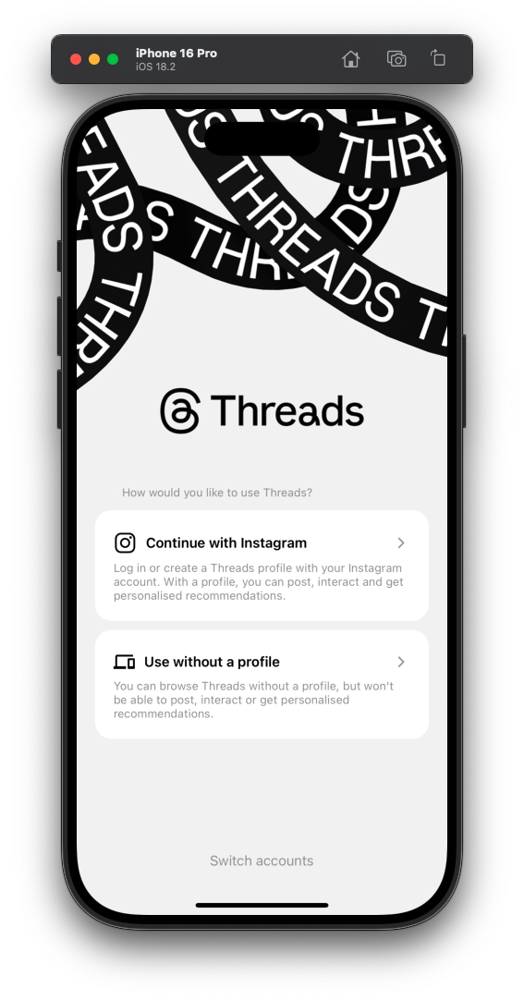
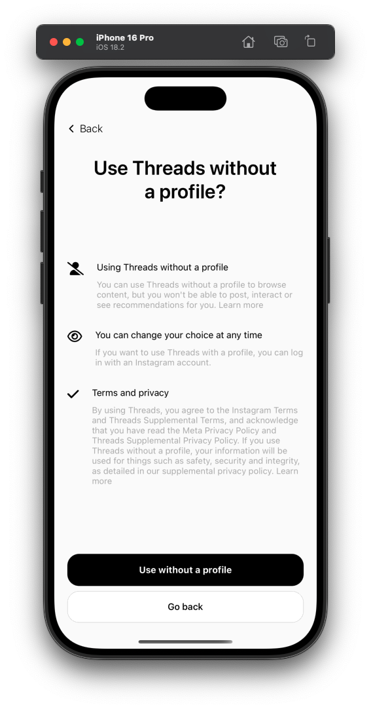
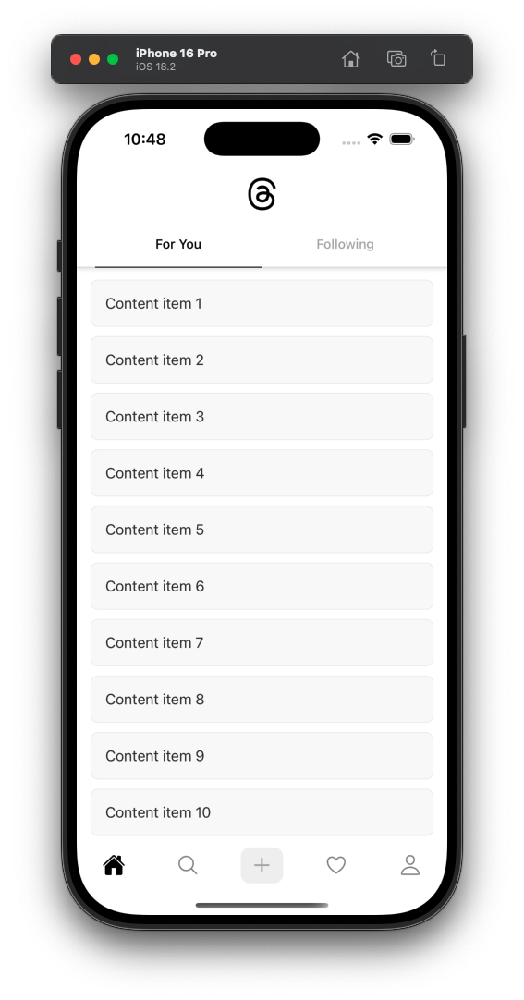
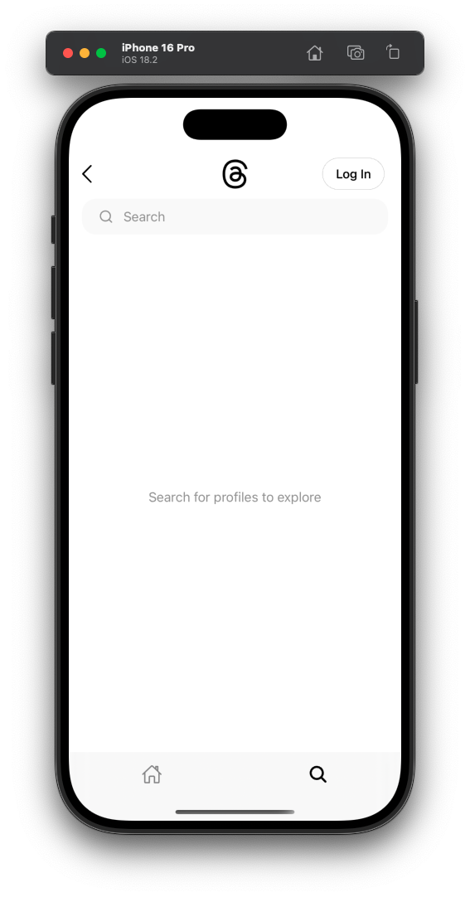
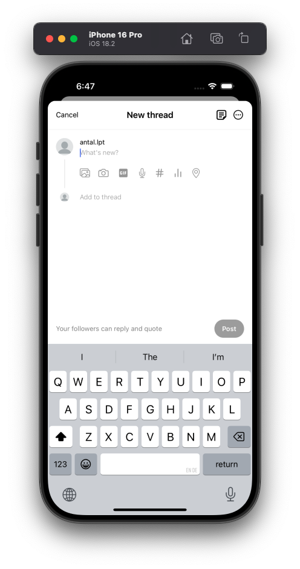
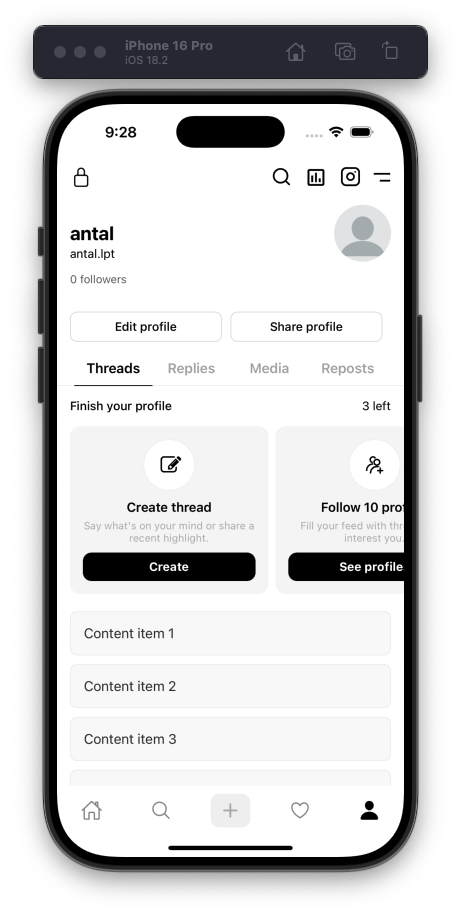

# Threads Clone

<div align="center">
  
  
  <p>A modern mobile application that replicates the core functionality of Threads.</p>

  <div>
    
    
    
  </div>
</div>

## ✨ Features

- **Custom Pull-to-Refresh Animation**: Smooth logo animation during refresh
- **User Authentication**: Secure login functionality via Clerk
- **Thread Feed**: Scrollable feed of user posts
- **Responsive UI**: Clean, modern interface adapting to various device sizes
- **Tab Navigation**: Intuitive navigation between app sections

## 📱 Screenshots

<div align="center">
  
  
  
  
  
  
</div>

## 🛠️ Technologies

- **Frontend**: React Native, Expo
- **Styling**: StyleSheet, Animated API
- **Authentication**: Clerk
- **Routing**: Expo Router
- **Type Checking**: TypeScript
- **UI Components**: Custom & Native components

## 📦 Installation

1. **Clone the repository**
   ```bash
   git clone https://github.com/antallpt/threads_clone.git
   cd threads_clone
   ```

2. **Install dependencies**
   ```bash
   npm install
   # or
   yarn install
   ```

3. **Environment Setup**
   - Create a `.env` file in the root directory
   - Add your configuration variables:
   ```
   EXPO_PUBLIC_CLERK_PUBLISHABLE_KEY=your_clerk_key_here
   # Add other environment variables as needed
   ```

4. **Start the development server**
   ```bash
   npx expo start
   ```

## 📱 Usage

- **Launch on iOS**: Press `i` in the terminal or click iOS in the Expo Go app
- **Launch on Android**: Press `a` in the terminal or click Android in the Expo Go app
- **Refresh**: Pull down on the main screen to see the custom refresh animation


## 📄 License

This project is licensed under the MIT License - see the LICENSE file for details.

## 🙏 Acknowledgements

- Inspired by [Threads](https://threads.net)
- Built with [Expo](https://expo.dev/)
- Authentication by [Clerk](https://clerk.dev/)

---

<div align="center">
  <sub>Built with ❤️ by Antal</sub>
</div>